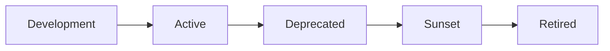

# API Versioning Strategy

This document outlines the API versioning strategy used in the Rails Next.js Commentable Project.

## Overview

The API uses **URL-based versioning** through Rails namespaces. This approach is:
- Simple and explicit
- Easy to understand for API consumers
- Compatible with all HTTP clients
- Allows for gradual migration between versions

## Version Format

All API endpoints are prefixed with `/api/v{version}/`:

```
/api/v1/users
/api/v1/videos
/api/v1/posts
```

## Current Versions

### Version 1 (v1) - Current
- **Base URL**: `/api/v1`
- **Status**: Active
- **Supported**: Yes
- **Deprecated**: No
- **Documentation**: `/api-docs`

## Versioning Rules

### 1. Breaking Changes Require New Version

A new API version is required when making breaking changes such as:
- Removing or renaming endpoints
- Changing request/response structure
- Modifying required parameters
- Changing authentication methods
- Altering error response formats

### 2. Non-Breaking Changes in Same Version

The following changes can be made within the same version:
- Adding new endpoints
- Adding optional parameters
- Adding new fields to responses
- Deprecating (but not removing) existing functionality
- Bug fixes
- Performance improvements

### 3. Version Lifecycle

Each API version follows this lifecycle:



- **Development**: Version is being developed, not publicly available
- **Active**: Version is stable and recommended for use
- **Deprecated**: Version is still functional but no longer recommended
- **Sunset**: Version is scheduled for removal (6-12 months notice)
- **Retired**: Version is no longer available

## Directory Structure

```
app/controllers/
└── api/
    ├── v1/
    │   ├── base_controller.rb
    │   ├── auth/
    │   ├── users_controller.rb
    │   ├── videos_controller.rb
    │   ├── posts_controller.rb
    │   └── ...
    └── v2/  # Future version
        └── ...
```

## Controller Inheritance

All versioned controllers inherit from the version-specific base controller:

```ruby
module Api
  module V1
    class UsersController < BaseController
      # Controller actions
    end
  end
end
```

This allows each version to have its own:
- Authentication logic
- Error handling
- Response formatting
- Middleware configuration

## Routing

Routes are organized by version using namespaces:

```ruby
namespace :api do
  namespace :v1 do
    resources :users
    resources :videos
    # ...
  end

  namespace :v2 do
    # Future version
  end
end
```

## Version Headers

While URL-based versioning is primary, the API also supports version information in response headers:

```
X-API-Version: v1
X-API-Deprecated: false
X-API-Sunset-Date: null
```

## Deprecation Process

### Step 1: Announce Deprecation (T+0)
- Update API documentation
- Add deprecation warnings to responses
- Send email notifications to API consumers
- Update changelog

### Step 2: Deprecation Period (T+3 months)
- Version remains fully functional
- Documentation shows "DEPRECATED" badge
- Response headers include deprecation warnings:
  ```
  X-API-Deprecated: true
  X-API-Deprecated-Date: 2024-01-01
  X-API-Sunset-Date: 2024-06-01
  ```

### Step 3: Sunset Notice (T+6 months)
- Final warning to all API consumers
- Response includes sunset date
- Migration guide published

### Step 4: Retirement (T+12 months)
- Version is completely removed
- Requests return 410 Gone status
- Migration guide remains available

## Version Discovery

Clients can discover available API versions:

```
GET /api/versions

Response:
{
  "versions": [
    {
      "version": "v1",
      "status": "active",
      "deprecated": false,
      "sunset_date": null,
      "documentation_url": "/api-docs/v1"
    }
  ],
  "current_version": "v1",
  "latest_version": "v1"
}
```

## Examples

### V1 Endpoint Structure

```
# Authentication
POST   /api/v1/auth/register
POST   /api/v1/auth/login
POST   /api/v1/auth/refresh
DELETE /api/v1/auth/logout

# Users
GET    /api/v1/users
GET    /api/v1/users/:id
PATCH  /api/v1/users/:id
DELETE /api/v1/users/:id

# Videos
GET    /api/v1/videos
POST   /api/v1/videos
GET    /api/v1/videos/:id
PATCH  /api/v1/videos/:id
DELETE /api/v1/videos/:id
POST   /api/v1/videos/:id/publish
POST   /api/v1/videos/:id/archive

# Comments (Polymorphic)
GET    /api/v1/videos/:video_id/comments
POST   /api/v1/videos/:video_id/comments
GET    /api/v1/posts/:post_id/comments
POST   /api/v1/posts/:post_id/comments
```

## Best Practices

### 1. Consistent Response Format

All versions should maintain a consistent response structure within that version:

```json
{
  "success": true,
  "data": { ... },
  "meta": {
    "current_page": 1,
    "total_pages": 10
  }
}
```

### 2. Error Responses

Error responses should be consistent within a version:

```json
{
  "success": false,
  "error": {
    "code": "VALIDATION_ERROR",
    "message": "Validation failed",
    "details": {
      "email": ["has already been taken"]
    }
  }
}
```

### 3. Backward Compatibility

When introducing a new version:
- Keep the previous version running
- Provide clear migration guides
- Offer automated migration tools when possible
- Support both versions during transition period

### 4. Documentation

Each version should have:
- Complete API reference
- Migration guides (when applicable)
- Deprecation notices
- Change logs
- Example requests/responses

## Future Considerations

### V2 Planning

When planning V2, consider:
- GraphQL endpoints alongside REST
- Improved pagination mechanisms
- Enhanced filtering capabilities
- Better real-time support (WebSockets)
- Optimized payload sizes
- Improved error granularity

## Health Check

Each version has its own health check endpoint:

```
GET /api/v1/health

Response:
{
  "success": true,
  "data": {
    "status": "healthy",
    "version": "v1",
    "timestamp": "2024-01-01T00:00:00Z",
    "database": "connected",
    "redis": "connected"
  }
}
```

## Support Policy

- **Active versions**: Full support, new features, bug fixes
- **Deprecated versions**: Security fixes only, no new features
- **Sunset versions**: Critical security fixes only
- **Retired versions**: No support

## Contact

For questions about API versioning:
- GitHub Issues: https://github.com/iamgerwin/rails_nextjs_commentable_project/issues
- Email: iamgerwin@live.com
