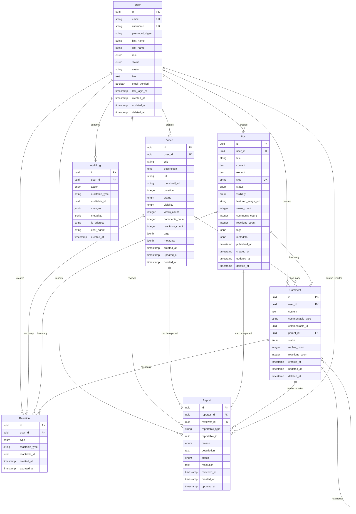

# Entity Relationship Diagram (ERD)

This document describes the database schema and entity relationships for the Rails Next.js Commentable Project.

## Overview

The system consists of the following core entities:
- **User**: Authentication and user management
- **Video**: Video content management
- **Post**: Blog posts and articles
- **Comment**: Polymorphic comments (on Videos and Posts)
- **Reaction**: Polymorphic reactions (on Videos, Posts, and Comments)
- **Report**: Content reporting system
- **AuditLog**: Audit trail for all entity changes

## ERD Diagram



## Entity Details

### User

The User entity manages authentication, authorization, and user profiles.

**Key Features:**
- Soft deletable (deleted_at)
- Email and username uniqueness
- Role-based access control (admin, moderator, user)
- Status management (active, inactive, suspended, deleted)
- Email verification
- Last login tracking

**Relationships:**
- Has many Videos
- Has many Posts
- Has many Comments
- Has many Reactions
- Has many Reports (as reporter)
- Has many Reports (as reviewer)
- Has many AuditLogs

### Video

The Video entity manages video content with metadata and visibility controls.

**Key Features:**
- Soft deletable
- Status workflow (draft, processing, published, archived, deleted)
- Visibility control (public, unlisted, private)
- Counter caches (views, comments, reactions)
- Tag support (JSONB array)
- Custom metadata (JSONB)

**Relationships:**
- Belongs to User
- Has many Comments (polymorphic)
- Has many Reactions (polymorphic)
- Has many Reports (polymorphic)

### Post

The Post entity manages blog posts and articles with rich content.

**Key Features:**
- Soft deletable
- Unique slug for SEO-friendly URLs
- Status workflow (draft, published, archived, deleted)
- Visibility control (public, unlisted, private)
- Counter caches (views, comments, reactions)
- Tag support (JSONB array)
- Custom metadata (JSONB)
- Featured image support
- Published timestamp

**Relationships:**
- Belongs to User
- Has many Comments (polymorphic)
- Has many Reactions (polymorphic)
- Has many Reports (polymorphic)

### Comment

The Comment entity provides polymorphic commenting on Videos and Posts with nested replies.

**Key Features:**
- Soft deletable
- Polymorphic association (commentable)
- Self-referential (parent_id for nested comments)
- Status management (active, hidden, deleted, flagged)
- Counter caches (replies, reactions)

**Relationships:**
- Belongs to User
- Belongs to Commentable (Video or Post)
- Belongs to Parent Comment (optional)
- Has many Reply Comments
- Has many Reactions (polymorphic)
- Has many Reports (polymorphic)

### Reaction

The Reaction entity manages user reactions (like, dislike, love, clap) on content.

**Key Features:**
- Polymorphic association (reactable)
- Type-based reactions (like, dislike, love, clap)
- Unique constraint (user can only react once per item with same type)

**Relationships:**
- Belongs to User
- Belongs to Reactable (Video, Post, or Comment)

### Report

The Report entity handles content and user reporting with moderation workflow.

**Key Features:**
- Polymorphic association (reportable)
- Reason categorization (spam, harassment, inappropriate, etc.)
- Status workflow (pending, reviewing, resolved, rejected)
- Reviewer assignment
- Resolution tracking
- Reviewed timestamp

**Relationships:**
- Belongs to Reporter (User)
- Belongs to Reviewer (User, optional)
- Belongs to Reportable (Video, Post, Comment, or User)

### AuditLog

The AuditLog entity provides comprehensive audit trail for HIPAA compliance.

**Key Features:**
- Polymorphic association (auditable)
- Action tracking (create, update, delete, restore)
- Change tracking (JSONB)
- Metadata storage (JSONB)
- IP address and user agent tracking
- Immutable (create-only)

**Relationships:**
- Belongs to User (optional, for system actions)
- Belongs to Auditable (any tracked entity)

## Indexes

### Performance Indexes

```sql
-- User indexes
CREATE UNIQUE INDEX idx_users_email ON users(email) WHERE deleted_at IS NULL;
CREATE UNIQUE INDEX idx_users_username ON users(username) WHERE deleted_at IS NULL;
CREATE INDEX idx_users_role ON users(role);
CREATE INDEX idx_users_status ON users(status);

-- Video indexes
CREATE INDEX idx_videos_user_id ON videos(user_id);
CREATE INDEX idx_videos_status ON videos(status);
CREATE INDEX idx_videos_visibility ON videos(visibility);
CREATE INDEX idx_videos_created_at ON videos(created_at DESC);
CREATE INDEX idx_videos_tags ON videos USING GIN(tags);

-- Post indexes
CREATE UNIQUE INDEX idx_posts_slug ON posts(slug) WHERE deleted_at IS NULL;
CREATE INDEX idx_posts_user_id ON posts(user_id);
CREATE INDEX idx_posts_status ON posts(status);
CREATE INDEX idx_posts_visibility ON posts(visibility);
CREATE INDEX idx_posts_published_at ON posts(published_at DESC);
CREATE INDEX idx_posts_tags ON posts USING GIN(tags);

-- Comment indexes
CREATE INDEX idx_comments_user_id ON comments(user_id);
CREATE INDEX idx_comments_commentable ON comments(commentable_type, commentable_id);
CREATE INDEX idx_comments_parent_id ON comments(parent_id);
CREATE INDEX idx_comments_created_at ON comments(created_at DESC);

-- Reaction indexes
CREATE INDEX idx_reactions_user_id ON reactions(user_id);
CREATE INDEX idx_reactions_reactable ON reactions(reactable_type, reactable_id);
CREATE INDEX idx_reactions_type ON reactions(type);
CREATE UNIQUE INDEX idx_reactions_unique ON reactions(user_id, reactable_type, reactable_id, type);

-- Report indexes
CREATE INDEX idx_reports_reporter_id ON reports(reporter_id);
CREATE INDEX idx_reports_reviewer_id ON reports(reviewer_id);
CREATE INDEX idx_reports_reportable ON reports(reportable_type, reportable_id);
CREATE INDEX idx_reports_status ON reports(status);

-- AuditLog indexes
CREATE INDEX idx_audit_logs_user_id ON audit_logs(user_id);
CREATE INDEX idx_audit_logs_auditable ON audit_logs(auditable_type, auditable_id);
CREATE INDEX idx_audit_logs_action ON audit_logs(action);
CREATE INDEX idx_audit_logs_created_at ON audit_logs(created_at DESC);
```

## Design Patterns

### Polymorphic Associations

This schema extensively uses polymorphic associations for:
- **Comments**: Can be attached to Videos or Posts
- **Reactions**: Can be attached to Videos, Posts, or Comments
- **Reports**: Can be attached to Videos, Posts, Comments, or Users
- **AuditLogs**: Can track any entity

### Counter Caches

Counter caches are used to avoid N+1 queries:
- `videos.views_count`, `videos.comments_count`, `videos.reactions_count`
- `posts.views_count`, `posts.comments_count`, `posts.reactions_count`
- `comments.replies_count`, `comments.reactions_count`

### Soft Deletes

Most entities support soft deletion (deleted_at timestamp):
- Users
- Videos
- Posts
- Comments

This allows for data recovery and maintains referential integrity.

### JSONB Fields

JSONB is used for flexible data storage:
- `tags`: Array of tag strings
- `metadata`: Custom key-value pairs
- `changes`: Audit log changes
- `metadata`: Audit log metadata

## Data Integrity

### Foreign Key Constraints

All foreign key relationships enforce referential integrity:
- `ON DELETE CASCADE`: For dependent records (e.g., comments when video is deleted)
- `ON DELETE SET NULL`: For optional references (e.g., reviewer_id in reports)

### Unique Constraints

- User email (unique when not soft-deleted)
- User username (unique when not soft-deleted)
- Post slug (unique when not soft-deleted)
- Reaction (user can only create one reaction of each type per item)

### Check Constraints

- Email format validation
- Positive integers for counters
- Valid enum values
- Duration must be positive for videos

## Scalability Considerations

1. **Partitioning**: AuditLog table can be partitioned by created_at for better performance
2. **Archiving**: Soft-deleted records can be archived to separate tables
3. **Read Replicas**: Separate read/write databases for scaling
4. **Caching**: Redis caching for frequently accessed data
5. **Search**: Elasticsearch integration for full-text search on posts and videos
