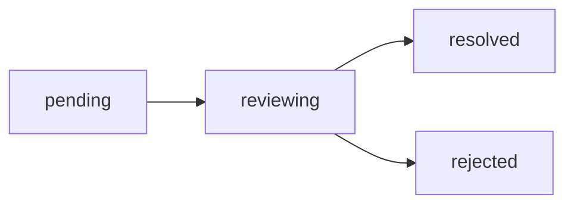

# Database Schema Documentation

This document provides comprehensive documentation for the database schema used in the Rails Next.js Commentable Project.

## Overview

The database uses **SQLite for development and testing** and **PostgreSQL for production** to balance simplicity and scalability.

### Database Adapters

| Environment | Adapter | Reason |
|-------------|---------|--------|
| Development | SQLite  | Zero configuration, file-based, easy setup |
| Test        | SQLite  | Fast, isolated, in-memory capable |
| Production  | PostgreSQL | Robust, scalable, full-featured |

## Table of Contents

- [Users](#users)
- [Videos](#videos)
- [Posts](#posts)
- [Comments](#comments)
- [Reactions](#reactions)
- [Reports](#reports)
- [Audit Logs](#audit-logs)
- [Indexes Strategy](#indexes-strategy)
- [Migration Best Practices](#migration-best-practices)

## Users

The `users` table manages authentication, authorization, and user profiles.

### Schema

```ruby
create_table :users, id: :string do |t|
  # Authentication
  t.string :email, null: false
  t.string :username, null: false
  t.string :password_digest, null: false

  # Profile
  t.string :first_name, null: false
  t.string :last_name, null: false
  t.text :bio
  t.string :avatar

  # Authorization
  t.string :role, null: false, default: 'user'
  t.string :status, null: false, default: 'active'

  # Email verification
  t.boolean :email_verified, default: false
  t.string :email_verification_token
  t.datetime :email_verified_at

  # Password reset
  t.string :password_reset_token
  t.datetime :password_reset_sent_at

  # Tracking
  t.datetime :last_login_at
  t.string :last_login_ip
  t.integer :sign_in_count, default: 0

  t.timestamps
  t.datetime :deleted_at
end
```

### Roles

- `admin` - Full system access
- `moderator` - Content moderation access
- `user` - Standard user access

### Statuses

- `active` - Account is active
- `inactive` - Account is inactive but can be reactivated
- `suspended` - Account is temporarily suspended
- `deleted` - Account is soft deleted

### Indexes

```ruby
add_index :users, :email, unique: true, where: 'deleted_at IS NULL'
add_index :users, :username, unique: true, where: 'deleted_at IS NULL'
add_index :users, :role
add_index :users, :status
add_index :users, :deleted_at
```

### Relationships

- **Has many** Videos
- **Has many** Posts
- **Has many** Comments
- **Has many** Reactions
- **Has many** Reports (as reporter)
- **Has many** Reports (as reviewer)
- **Has many** Audit Logs

## Videos

The `videos` table manages video content with metadata and engagement tracking.

### Schema

```ruby
create_table :videos, id: :string do |t|
  t.string :user_id, null: false
  t.string :title, null: false
  t.text :description
  t.string :url, null: false
  t.string :thumbnail_url
  t.integer :duration, null: false, default: 0
  t.string :status, null: false, default: 'draft'
  t.string :visibility, null: false, default: 'private'
  t.json :tags, default: []
  t.json :metadata, default: {}
  t.integer :views_count, default: 0
  t.integer :comments_count, default: 0
  t.integer :reactions_count, default: 0
  t.datetime :published_at
  t.timestamps
  t.datetime :deleted_at
end
```

### Statuses

- `draft` - Video is being edited
- `processing` - Video is being processed
- `published` - Video is published and visible
- `archived` - Video is archived
- `deleted` - Video is soft deleted

### Visibility

- `public` - Visible to everyone
- `unlisted` - Visible to those with the link
- `private` - Visible only to the owner

### Counter Caches

- `views_count` - Total video views
- `comments_count` - Total comments
- `reactions_count` - Total reactions

### JSON Fields

```json
// tags
["technology", "tutorial", "ruby"]

// metadata
{
  "resolution": "1080p",
  "fps": 30,
  "codec": "h264",
  "file_size": 104857600
}
```

## Posts

The `posts` table manages blog posts and articles with rich content.

### Schema

```ruby
create_table :posts, id: :string do |t|
  t.string :user_id, null: false
  t.string :title, null: false
  t.text :content, null: false
  t.text :excerpt
  t.string :slug, null: false
  t.string :featured_image_url
  t.string :status, null: false, default: 'draft'
  t.string :visibility, null: false, default: 'private'
  t.json :tags, default: []
  t.json :metadata, default: {}
  t.integer :views_count, default: 0
  t.integer :comments_count, default: 0
  t.integer :reactions_count, default: 0
  t.datetime :published_at
  t.timestamps
  t.datetime :deleted_at
end
```

### Slug Generation

Slugs are auto-generated from titles:
- "Hello World" → "hello-world"
- "10 Best Practices" → "10-best-practices"
- Ensures uniqueness with append numbers if needed

### Content Format

The `content` field supports:
- Plain text
- Markdown
- HTML (sanitized)

## Comments

The `comments` table provides polymorphic commenting with nested replies.

### Schema

```ruby
create_table :comments, id: :string do |t|
  t.string :user_id, null: false
  t.string :commentable_type, null: false
  t.string :commentable_id, null: false
  t.string :parent_id # for nested replies
  t.text :content, null: false
  t.string :status, null: false, default: 'active'
  t.integer :replies_count, default: 0
  t.integer :reactions_count, default: 0
  t.timestamps
  t.datetime :deleted_at
end
```

### Polymorphic Association

Comments can belong to:
- **Videos** (`commentable_type: 'Video'`)
- **Posts** (`commentable_type: 'Post'`)

### Nested Comments

Comments support unlimited nesting via self-reference:

```
Comment (parent)
  └─ Comment (child/reply)
      └─ Comment (grandchild/reply to reply)
```

### Statuses

- `active` - Comment is visible
- `hidden` - Comment is hidden by moderator
- `deleted` - Comment is soft deleted
- `flagged` - Comment has been flagged for review

## Reactions

The `reactions` table manages user reactions on content.

### Schema

```ruby
create_table :reactions, id: :string do |t|
  t.string :user_id, null: false
  t.string :reactable_type, null: false
  t.string :reactable_id, null: false
  t.string :type_name, null: false
  t.timestamps
end
```

### Polymorphic Association

Reactions can belong to:
- **Videos** (`reactable_type: 'Video'`)
- **Posts** (`reactable_type: 'Post'`)
- **Comments** (`reactable_type: 'Comment'`)

### Reaction Types

- `like` - 👍 Like
- `dislike` - 👎 Dislike
- `love` - ❤️ Love
- `clap` - 👏 Clap

### Unique Constraint

One user can only create one reaction of each type per item:

```ruby
add_index :reactions, [:user_id, :reactable_type, :reactable_id, :type_name],
          unique: true
```

## Reports

The `reports` table handles content and user reporting with moderation workflow.

### Schema

```ruby
create_table :reports, id: :string do |t|
  t.string :reporter_id, null: false
  t.string :reviewer_id
  t.string :reportable_type, null: false
  t.string :reportable_id, null: false
  t.string :reason, null: false
  t.text :description
  t.string :status, null: false, default: 'pending'
  t.text :resolution
  t.datetime :reviewed_at
  t.timestamps
end
```

### Polymorphic Association

Reports can report:
- **Videos** (`reportable_type: 'Video'`)
- **Posts** (`reportable_type: 'Post'`)
- **Comments** (`reportable_type: 'Comment'`)
- **Users** (`reportable_type: 'User'`)

### Report Reasons

- `spam` - Spam or advertising
- `harassment` - Harassment or bullying
- `inappropriate` - Inappropriate content
- `misinformation` - False or misleading information
- `copyright` - Copyright violation
- `other` - Other reasons (requires description)

### Status Workflow



- `pending` - Report created, awaiting review
- `reviewing` - Report is being reviewed by moderator
- `resolved` - Report resolved with action taken
- `rejected` - Report rejected, no action taken

## Audit Logs

The `audit_logs` table provides comprehensive audit trail for HIPAA compliance.

### Schema

```ruby
create_table :audit_logs, id: :string do |t|
  t.string :user_id
  t.string :action, null: false
  t.string :auditable_type, null: false
  t.string :auditable_id, null: false
  t.json :changes, default: {}
  t.json :metadata, default: {}
  t.string :ip_address
  t.text :user_agent
  t.datetime :created_at, null: false
end
```

### Immutability

Audit logs are **immutable**:
- No `updated_at` timestamp
- No update or delete operations
- Preserved even when associated records are deleted

### Actions

- `create` - Record created
- `update` - Record updated
- `delete` - Record deleted (soft delete)
- `restore` - Record restored from soft delete

### Changes Format

```json
{
  "before": {
    "title": "Old Title",
    "status": "draft"
  },
  "after": {
    "title": "New Title",
    "status": "published"
  }
}
```

### Metadata Format

```json
{
  "controller": "Api::V1::VideosController",
  "action": "update",
  "request_id": "uuid",
  "session_id": "session-uuid"
}
```

## Indexes Strategy

### Performance Indexes

All foreign keys have indexes for join performance:

```ruby
add_index :videos, :user_id
add_index :comments, :user_id
add_index :reactions, [:reactable_type, :reactable_id]
```

### Unique Indexes

Partial unique indexes for soft-deleted records:

```ruby
add_index :users, :email, unique: true, where: 'deleted_at IS NULL'
add_index :posts, :slug, unique: true, where: 'deleted_at IS NULL'
```

### Composite Indexes

For common query patterns:

```ruby
add_index :videos, [:status, :visibility, :published_at]
add_index :posts, [:status, :visibility, :published_at]
```

### Full-Text Search (Future)

For production PostgreSQL, consider adding:

```ruby
add_index :posts, :content, using: :gin, opclass: :gin_trgm_ops
add_index :videos, :title, using: :gin, opclass: :gin_trgm_ops
```

## Migration Best Practices

### 1. Timestamps

Always include timestamps for audit trails:

```ruby
t.timestamps # adds created_at and updated_at
```

### 2. NOT NULL Constraints

Use NOT NULL for required fields:

```ruby
t.string :title, null: false
```

### 3. Default Values

Provide sensible defaults:

```ruby
t.string :status, null: false, default: 'draft'
t.integer :views_count, default: 0
```

### 4. Foreign Keys

Always add foreign key constraints:

```ruby
add_foreign_key :videos, :users, on_delete: :cascade
```

### 5. Indexes

Add indexes for:
- Foreign keys (automatic joins)
- Unique constraints (data integrity)
- Where clauses in queries (performance)
- Order by fields (sorting)

### 6. Database Agnostic

Write migrations that work on both SQLite and PostgreSQL:

```ruby
# Good: works on both
t.json :metadata, default: {}

# Avoid: PostgreSQL-specific
t.jsonb :metadata, default: {}
```

### 7. Reversible Migrations

Ensure migrations can be rolled back:

```ruby
def change
  # Reversible by default
end

# Or for complex migrations:
def up
  # Migration code
end

def down
  # Rollback code
end
```

## Running Migrations

```bash
# Run all pending migrations
rails db:migrate

# Rollback last migration
rails db:rollback

# Rollback last 3 migrations
rails db:rollback STEP=3

# Reset database (drop, create, migrate, seed)
rails db:reset

# View migration status
rails db:migrate:status
```

## Database Seeds

See `db/seeds.rb` for sample data generation using Faker gem.

## Backup Strategy

### Development/Test
- SQLite databases are stored in `storage/`
- Backed up via Git (excluded in production)

### Production
- PostgreSQL automated backups
- Point-in-time recovery enabled
- Daily snapshots retained for 30 days

## Database Size Estimates

Based on typical usage patterns:

| Table | Estimated Rows | Estimated Size |
|-------|---------------|----------------|
| Users | 100,000 | 50 MB |
| Videos | 500,000 | 200 MB |
| Posts | 1,000,000 | 500 MB |
| Comments | 5,000,000 | 1 GB |
| Reactions | 10,000,000 | 500 MB |
| Reports | 50,000 | 25 MB |
| Audit Logs | 20,000,000 | 5 GB |
| **Total** | | **~7.3 GB** |

## Performance Considerations

### N+1 Query Prevention

Use counter caches and eager loading:

```ruby
# Bad: N+1 queries
videos.each { |v| v.comments.count }

# Good: Counter cache
videos.each { |v| v.comments_count }

# Good: Eager loading
Video.includes(:comments, :user)
```

### Pagination

Always paginate large result sets:

```ruby
Video.page(params[:page]).per(25)
```

### Soft Delete Scopes

Always exclude soft-deleted records:

```ruby
scope :active, -> { where(deleted_at: nil) }
Video.active.published
```

## Related Documentation

- [ERD Diagram](../architecture/erd.md)
- [API Documentation](../api/README.md)
- [Model Documentation](./models.md)
